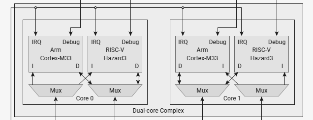

= RP2350最速調査
村岡太郎 (KoRoN, @kaoriya)
2024/08/12 発行
:source-highlighter: rouge
//:toc: right
//:figure-caption: 図
// for asciidoctor-pdf
:scripts: cjk
:compress:
:title-page:
//:doctype: book
//:media: prepress

<<<
## はじめに
'''

2024/08/09に日本時間0時に突如 Raspberry Pi Pico 2 (以下 Pico 2)が発表されました。
Pico 2 は名前からわかるように2021年に発売された Raspberry Pi Pico (以下 Pico 1)の後継で、
とても興味深い新MCU RP2350を搭載しての発表となりました。
私はPico 1のMCUである RP2040 のブレイクアウトボードを自ら設計し手はんだで組み立てた経験があるほどのファンであるため、
とても興味を持って Pico 2 というよりは RP2350 のひととおりの発表資料を2日かけ斜め読みしました。
特にデータシートは約640ページから約1350ページに増量していて長かった…

本書はその調査時のメモを元に自分が気になった要点をまとめたものです。
粗く読んだ際のメモを元に編纂しているので間違いなどがあるかもしれませんので、
実際に利用する際には以下の原典に当たることを強くお勧めいたします。

プロダクト概要::
https://datasheets.raspberrypi.com/rp2350/rp2350-product-brief.pdf
データシート::
https://datasheets.raspberrypi.com/rp2350/rp2350-datasheet.pdf
ハードウェアデザインガイド::
https://datasheets.raspberrypi.com/rp2350/hardware-design-with-rp2350.pdf
Raspberry Piドキュメント > RP2350::
https://www.raspberrypi.com/documentation/microcontrollers/silicon.html#rp2350

<<<
## RP2350の概要
'''

RP2040 と比べた時に特に際立つ RP2350 の特徴を以下に挙げます。

* プロセッサの変更
** ARMコアが Cortex-M0 から Cortex-M33 へ変更
** ARMコア以外に RISC-V コアが搭載され、実行時に選択できる
* 同一シリーズ内に4つの異なる版が計画されている
** 30本だったGPIOが48本へ増量された `B` 版
** 2MBのFlash ROMを内蔵した `2354` 版
* 各種セキュリティ機能の実装
* その他の変更
** コア用レギュレーターがリニアからスイッチングへ変更
** RAMが520KBへと倍増
** PIOの増量とHSTXの追加

全体としてRP2350はRP2040と比べて、とにかくセキュリティに注力したMCUだと言えます。
プロセッサーから始まりFlashやGPIOなどあらゆる要素にセキュリティのための追加・変更があります。

プログラマーとしてはRISC-Vコアの採用が目新しく、とても気になります。
ただRISC-Vコアを利用すると前述のセキュリティ機能のいくつかが利用できなくなるため、
パッケージ構成の目的としては一貫性を欠くことになります。
だからこそRISC-Vコアの導入自体、将来の移行を見据えた目的なのかもしれないと推測できます。

結果的にRP2350のコアはRP2040に比べて多くの機能が増え、最大消費電力が増えました。
増えた電力消費を支えるためチップに搭載されたレギュレーターがスイッチング方式へ変更され、
そのためレギュレーターの周辺回路の設計要件がとても厳しくなっています。

### プロセッサーの変更

RP2350ではCortex-M33をARMコアに採用しています。
これはRP2040のM0から考えると、世代交代及びARM TrustZoneによる安全性向上が目的だろうと考えられます。
M0からのステップアップであればM23でも良いと考えられるのですが、
DSP的なハイパフォーマンス領域も視野に入れたということなのでしょう。

コア数は相変わらず2個ですが、RP2350ではRISC-Vコアも2つ搭載しています。
RISC-Vコアにはオープンソースハードウェアである Hazard3 (https://github.com/Wren6991/Hazard3) を採用しています。

各コアはそれぞれでARMコアとRISC-Vコアを選択できます。(図1参照)
この選択は基本的にブートROMが実行イメージを読み込む時に自動的に行われます。
実行イメージにはアーキテクチャを示すマークがあるので、それを見てるということです。
またうまく構成すればCore 0にARMコアを、Core 1にRISC-Vをという非対称な選択も可能です。

.コアの構成 (データシート: Chapter 3. Processor Subsystem より)
[caption="図1"]

### 異なる4つの版がリリース予定

RP2350には2箇所の細部の異なる、合計4つのバリエーションが提供される予定です。
1箇所目の異なる部分はGPIOの本数で、RP2040同様の30本である末尾 `A` と、18本増えて48本になった末尾 `B` 版があります。

2か所目の異なる部分は内蔵Flashの有無で、これまで通りFlashが内蔵されない下2桁 `50` と、新たに2MBのFlashを内蔵した下2桁 `54` 版に分かれます。
これによりRP2350シリーズは以下の異なる4つの型番で提供されることになります。

* RP2350A - Flash無し、GPIO30本
* RP2350B - Flash無し、GPIO48本
* RP2354A - 2MB Flash内蔵、GPIO30本
* RP2354B - 2MB Flash内蔵、GPIO48本

特にFlashの内蔵は実装に必要な部品点数が減らせるため歓迎されるシーンも多いでしょう。
2MBというサイズは現代のプログラマーからしたら非常に小さいですが、
RP2350が主にターゲットとする組み込み機器の観点からは充分な大きさと言えるでしょう。

GPIOの本数増加は多数のセンサーやサーボモーターを持つロボットや、
キーマトリックスを用いない類の自作キーボードでは歓迎されると推測されます。
またこれに併せてGPIOの管理をするレジスタが64ビットに拡張されていました。

### 各種のセキュリティ機能

ARMコアにTrustZone実装が実装されてることからもわかるように、
RP2350には全体にわたってセキュリティのための機能が追加・変更されています。
幾つかの例を以下に挙げます。

* 1度だけ書き換え可能(OTP: One-Time Programmable)なストレージ 
** セキュリティの構成情報: デバッグ無効化、セキュアブート有効化
** カスタムブートローダー
** 署名検証(セキュアブート)のための公開鍵
** 暗号化されたFlashイメージを復号化するための秘密鍵(対称鍵)
** 各種識別情報のオーバーライド
* 暗号化されたFlashイメージの復号化
* Flash上のイメージの署名検証(セキュアブート)
* SHA-256のアクセラレータ
* 真正乱数生成器(TRNG)
* グリッチ検出

これらが目指しているセキュリティ機能は以下の3つからなっています。

. 不正なコードを実行できないようにする
. コードとデータの不正な読み取りを防ぐ
. デバイス上で実行されるソフトウェアを、信頼できるものと信頼できないものとで分離する

これらの機能はRP2040には欠けていた、ソフトウェアやハードウェアの不正利用対策としての、
セキュリティ機能としてRP2350に付け加えられたと考えられます。
このセキュリティ機能があることで、量産・市販されるような製品にRP2350が採用されやすくなりそうです。

### その他の変更

#### スイッチングレギュレーター

コア用レギュレーターがリニアレギュレーターからスイッチングレギュレーターに変更になりました。
RP2350はRP2040から引続きコア部分の電圧1.1Vに使えるようにレギュレーターを内蔵しています。
しかしコアの機能が増えたことにより、最大消費電力が200mAに増えました。
もちろん常に200mAを必要とするわけではないですが、
その大きな電力消費を支えられる供給能力を確保する目的でスイッチングレギュレーターに変更したとのことです。

スイッチングレギュレーターに変更したためにコイルとコンデンサが周辺回路に必要となり、
加えて利用できる面積が少ないことからコイルが発生する磁場がコンデンサ他に影響を与えることとなり、
基板の設計に関してリファレンスデザインに従うことという強い勧告が書かれていました。
またコイルの巻き方向も固定する必要があるということで、
方向を識別できるコイルをメーカーと協力して新規開発し、
まもなく型番を付与して一般提供をするほどのタイトさのようです。

常に200mAという最大電力が必要なわけではないので、
利用する製品ごとにその製品で十分なだけの設計とテストを行うという方法も考えられます。
しかしこの点に関しては使いにくくなったと評価せざるを得ません。

#### RAMの増量

RAMはRP2040の264KB(256+8)から、RP2350では520KB(512+8)へとほぼ倍増しました。

セキュアブートにおいてはFlash上の実行コードを全部RAMに展開し、そのRAM上で実行する必要があるからだと考えられます。
RP2040では16KBのバッファを用いて仮想メモリ的に随時プログラムをFlashから読みだして実行していました。
この方法には実行時にFlashを差し替えることで別のプログラムを実行することができるという脆弱性があり、
それに対策するものだと推測できます。
仮にRAMを増やさずにその多くを実行コードで占めてしまうと、
ワークエリアが減ってしまいRP2040に比べてプログラムが作りにくいことになってしまいます。
それを回避するためにはやはりRAMを増やす必要があったのでしょう。

セキュアブートを用いない場合、単純に高速なワークエリアが倍に増えたということで、プログラマーとしては非常に歓迎できます。

#### PIOの増量とHSTXの追加

PIOは簡易なプログラムが可能なサブプロセッサで、高速な信号処理などに用います。
人間の脳で例えれば小脳のようなもの、というのが近いかもしれません。
RP2350ではこのPIOが2機から3機に増えました。
これにより1.5倍の信号を処理できるようになりました。

またHSTXという1クロックあたり2ビット送出できる、
高速にシリアルデーターをストリーミング出力する機能が追加されています。
RP2350は最大150MHzで駆動しますので最大300Mbpsに達します。
また最大8つのGPIOに対して出力できるので、
上手くデータを用意できるのであれば最大2.4Gbpsの送出能力とも言えるでしょう。

PIOの増量とHSTXの追加からは、
RP2350はデジタル信号処理というアプリケーションを強く意識して企画されたと推測できます。

<<<
## おわりに
'''

以上、RP2350の資料を読んで気になったところを紹介しました。

全体を通してセキュアブートの導入と信号処理能力の増加が目立ち、
本気で商業量産製品への組み込みを目指しているんだなと感じました。
またFlash内蔵モデルの登場ということも、その思いを強める一因となりました。
一方でレギュレーター周りの回路や、クロック回りの回路の設計要件の厳しさを見ると、
前出の目的とは矛盾しているような感想を抱きました。

RP2350ではデータシートの構成も大きく変わりました。
今となってはRP2040はPIOという新しい概念の説明に大きな比重を割いていたのがわかります。
一方でRP2350では各部に渡るセキュリティ機能を重視していると強く感じさせられました。
このような詳細なデータシートが無料で誰でも閲覧できるのは、
オープンなソフトウェア業界に慣れた今となってはとてもありがたいと感じます。

本書では触れませんでしたが、RP2040で利用できたSDKであるpico-sdkはRP2350でも利用できると考えられます。
一つ一つ丁寧に読めばSDKの構成だけでなく、MCUの構成まで良く分かる非常によくできたSDKですので、
まだ触れたことのないプログラマは是非触れてみることをオススメします。

2024/08/12 村岡太郎 (a.k.a. KoRoN, or @kaoriya)
